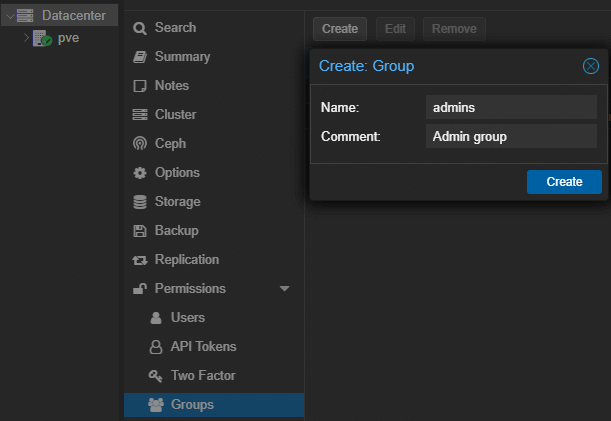
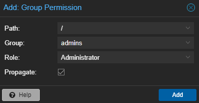
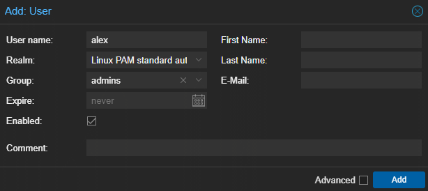

# Manage Proxmox users and groups

## 1. Create an `admins` group



## 2. Add permission to `admins` group
- Go to `Datacenter` > `Permissions` > `add` > `Group Permission`
	
- add **`Administrator`** role to the path **`/`** for the `admins` group
  - 

## 3. Create users
### Create a PAM user
  - on linux system, create a user and set his password
	```sh
	adduser [options] <username>
	```
  - In proxmox GUI, create a PAM user, add had him to the `admins` group
	


## Usefull linux commands
- list users
	```sh
	cat /etc/passwd
	```

- add user
  - with prompt
	```sh
	adduser <username>
	```
  - without prompt. Use -m / --create-home to create home dir as `/home/username`
	```sh
	useradd -m <username>
	passwd <username>
	```

- delete user
	```sh
	userdel <username>
	```

## Permissions
- list groups :
	```sh
	cat /etc/group
	```

- add user to group
	```sh
	usermod -a -G examplegroup exampleusername
	```